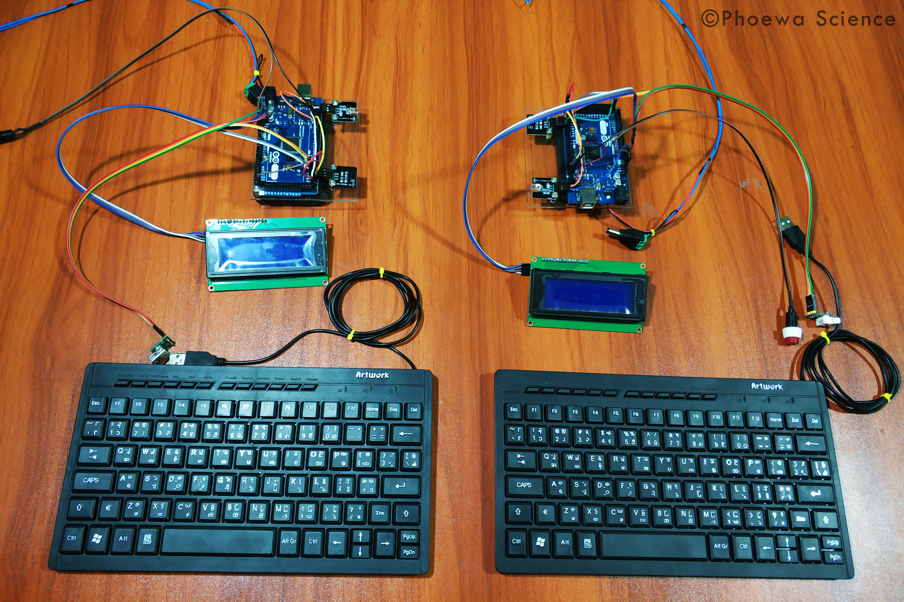

# text-transfers-using-IR
Transmit and Receive Text Over IR Signals with an Arduino

<a><b>Figure:</b> Transmit and Receive Text Over IR Signals</a>

<a><b>Figure:</b> Circuit Diagram with Arduino Mega</a>

## With Arduino Uno
If you use Arduino Uno, navigate to the following directory
**/home/$USER/Arduino/libraries/Arduino-IRremote-master/src/private/**
edit **IRTimer.hpp** as shown in the figure below and then Restart Arduino IDE.

<a><b>Figure:</b> IR_SEND_PIN Declare</a>

## Download require libraries
`git clone https://github.com/Arduino-IRremote/Arduino-IRremote`
 
`git clone https://github.com/PaulStoffregen/PS2Keyboard`

`git clone https://github.com/WickedLukas/Newliquidcrystal_1.3.5`
    
## Library Installation

* Open Arduino IDE (Arduino Software)

* Sketch > Include Library > Add .Zip Library

* and choose library zip file.

* Done.

